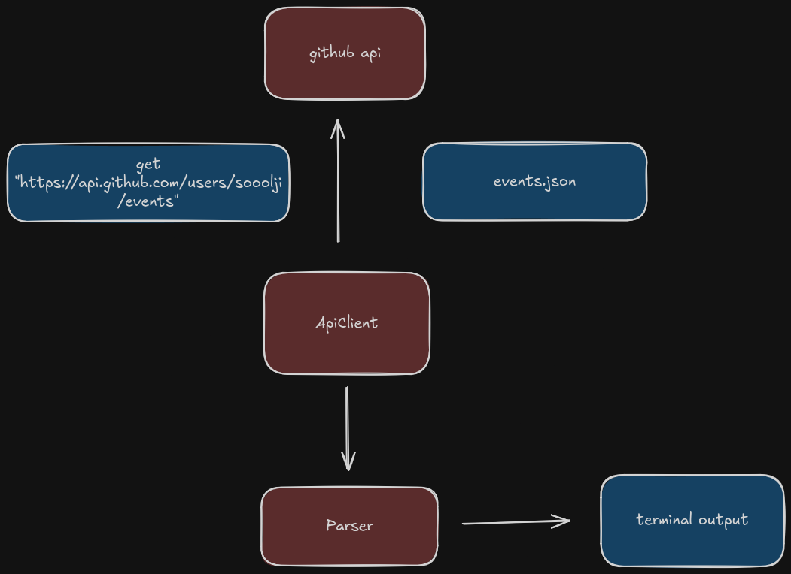

# GitHub User Activity CLI

A simple command-line interface tool written in C++ to fetch and display a GitHub user's recent public activity.

## App Flow



## Tools Used

1. **libcurl**: A free, highly portable, thread-safe, and feature-rich client-side URL transfer library supporting numerous protocols including HTTP, HTTPS, FTP, and SMTP.
2. **nlohmann/json**: Often referred to as "JSON for Modern C++," it's a popular open-source, header-only library that simplifies working with JSON data in C++. It provides an intuitive syntax and integrates seamlessly with C++'s Standard Template Library (STL).
3. **GoogleTest**: A C++ testing framework used for writing and running unit tests.

## Build and Run

To build the project, you need `cmake` and a C++ compiler installed on your system.

```bash
cmake -S . -B build
cmake --build build
cd build
./github-activity <username>
```

Example:

```bash
./github-activity sooolji
```

## Running Tests

## Some Cool Stuff

Want to help out? Here are some awesome features we can add next:

- **Terminal Colors & Styling:** Add ANSI color codes or use a nice library like `fmt` to color-code different GitHub events (e.g., green for `PushEvent`, yellow for `StarEvent`).
- **Filtering System:** Add flags to filter activity. For example: `github-activity username --type IssuesEvent` or `--limit 5`.
- **Export Features:** Add an option to export a user's recent activity to a Markdown or CSV file for report generation.
